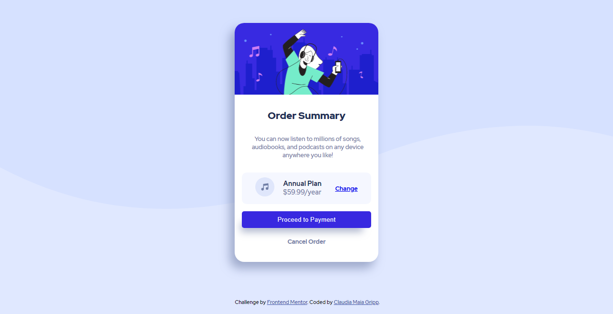

# Frontend Mentor - Order summary card solution

This is a solution to the [Order summary card challenge on Frontend Mentor](https://www.frontendmentor.io/challenges/order-summary-component-QlPmajDUj). Frontend Mentor challenges help you improve your coding skills by building realistic projects. 

## Table of contents

  - [The challenge](#the-challenge)
  - [Screenshot](#screenshot)
  - [Links](#links)
  - [My process](#my-process)
  - [Built with](#built-with)
  - [What I learned](#what-i-learned)
  - [Continued development](#continued-development)
  - [Useful resources](#useful-resources)
  - [Author](#author)

### The challenge

  O desafio consistia em recriar o layout de um card de fechamento de pedido, chegando mais próximo possível do design proposto.

  Requisito:
  - Adicionar hover status em elementos interativos

### Screenshot

### Links

- Solution URL: (https://github.com/maiagripp/frontendmentor-order-summary)
- Live Site URL: (https://frontendmentor-order-summary.vercel.app/)

## My process

Meu processo foi tentar usar HTML semântico, o bom uso de seletores css e tentar chegar o mais próximo do design proposto.

### Built with

- Semantic HTML5 markup
- CSS custom properties
- Flexbox

### What I learned

O melhor uso do flexbox e o uso de seletores css.

### Continued development

Entender cada vez mais o uso do flexbox e a melhor forma de estruturar o css de forma a reutilizar propriedades.

### Useful resources

- [Seletores CSS](https://developer.mozilla.org/pt-BR/docs/Web/CSS/CSS_Selectors) - O guia do Mozilla me ajudou a lembrar dos seletores corretos.

## Author

- Github - [@maiagripp](https://github.com/maiagripp)
- Frontend Mentor - [@maiagripp](https://www.frontendmentor.io/profile/maiagripp)
- Linkedin - (https://www.linkedin.com/in/claudia-maia-gripp/)
